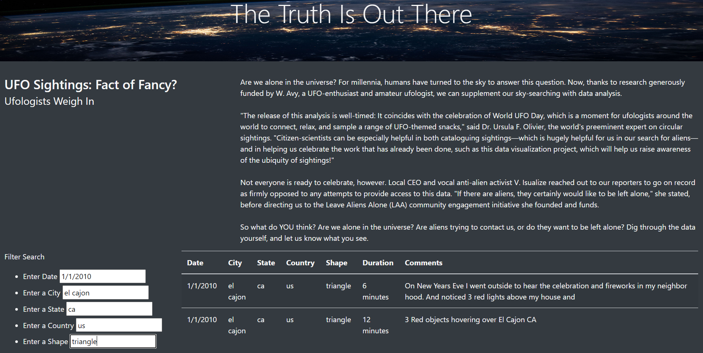

# UFOs

## Overview:

### The purpose of this analysis is to create an html file to visualize UFO sightings data.  Additionally, the html file will be formatted in order to easily sort through specific criteria within the UFO data. 

## Results:

### The UFO data can be filtered by performing a search.  In order to perform the seach, the user must enter specific criteria in the seach box (date, city, state, country, shape) and then press the enter button.  The user can fill out any number of the search criteria in order specify the data they are interested in viewing. The following image shows a seach performed for UFO data that occured in El Cajon, CA, in the United States on 1/1/2010 with a triangle shape.  When the user wants to clear the seach critera, the UFO Sightings button in the top left corner must be clicked. 

## Summary:

### One drawback of this webpage is that it is difficult to evaluate the potential options in each search category. A recommendation to fix this would be to add drop down selections for each filter box that lists the options in each category.  The user will be able to select the option from the drop down box that they want to view in order to fill out the search criteria box.  Another recommedation for further development of the webpage would be to incorporate a data table that is updated with real-time UFO sighting data. 
